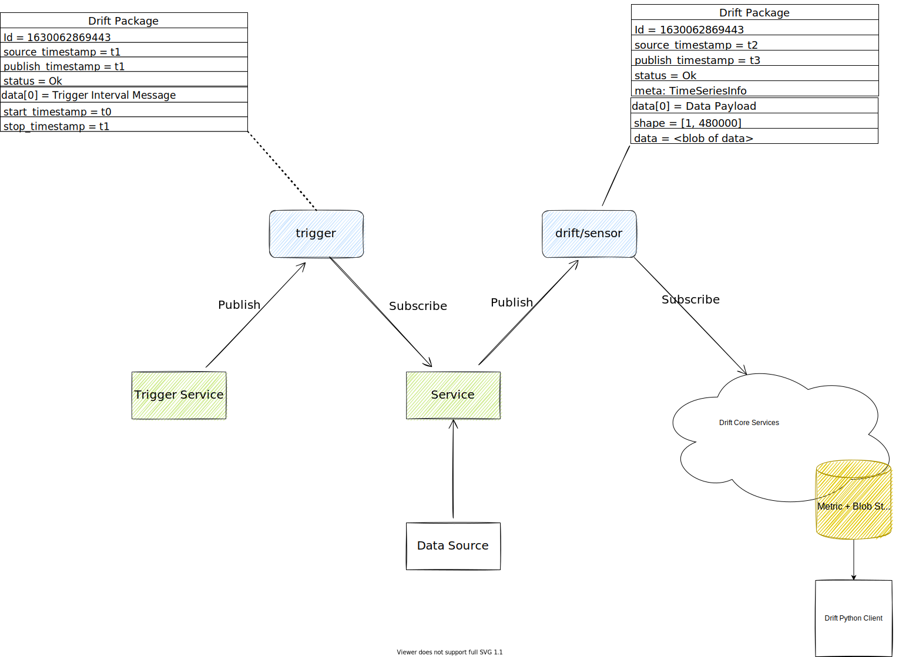

# Drift Protocol

Protobuf Libraries to encode message
in [PANDA|Drift infrastructure](https://driftpythonclient.readthedocs.io/en/latest/docs/panda_drift/).
The libraries provide pre-generated Protobuf messages so that you don't need to install protobuf compiler and
generate them yourself.

## Implementations

* [For C++](cpp/README.md)
* [For Python](python/README.md)

## Example

Here you can see a simple microservice application based on Drift Protocol:

Trigger Service publishes a trigger as a [Drift Package](docs/api/common.md#driftpackage) with ID = 1630062869443 and
a [Trigger Interval Message](docs/api/triggering.md#intervaltriggermessage), which contains a time interval [t0, t1], to
the  `trigger` MQTT topic.

Timeswipe Service subscribes on the `trigger` topic and receives the trigger package. Then it retrieves data of 48000
points from some data source for the interval [t0, t1], compresses, serializes the data and sends it to MQTT
topic `drift/sensor` as a [Drift Package](docs/api/common.md#driftpackage) with
a [Data Payload](docs/api/common.md#datapayload) inside. It contains a
serialized [Wavelet Buffer](https://github.com/panda-official/WaveletBuffer) in the `data` field. The ID of the packages
is the same ID=1630062869443, so we see that the trigger and the data are connected.

The [Drift Core](https://driftpythonclient.readthedocs.io/en/latest/docs/panda_drift/) services subscribe on all MQTT
topics which have `drift/` prefix, parse [Drift Packages](docs/api/common.md#driftpackage) and store them in the metric
and blob storages. After that, you can use [Drift Python Client](https://github.com/panda-official/DriftPythonClient) to
request data from the storage.

## Related Projects

* [WaveletBuffer](https://github.com/panda-official/WaveletBuffer) - A universal C++ compression library based on
  wavelet transformation
* [Drift Python Client](https://github.com/panda-official/DriftPythonClient) - Python Client to access data of
  PANDA|Drift